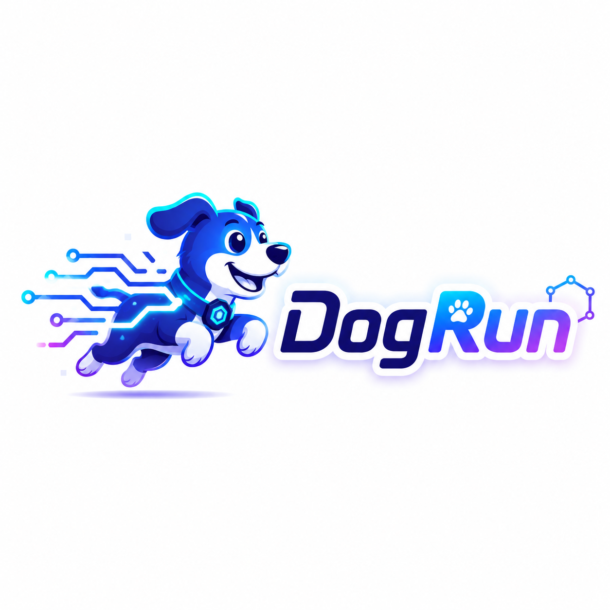

# DogRun Media Download



DogRun Media Download is a Windows desktop app for downloading, organizing, previewing, and trimming online media. It is built with Tauri v2, React, TypeScript, and Rust.

Author: [DogRun Labs](https://github.com/dogrunlabs)

## Features

- Download single video links with live progress.
- Batch download multiple links from a compact dialog.
- Save downloads to a configurable folder.
- Persist download history locally.
- Generate thumbnails with `ffmpeg` and `ffprobe`.
- Reveal files in Explorer, copy files, open source links, and delete history items.
- Trim downloaded videos with a preview player, draggable timeline, generated frame strip, and save/copy clip actions.
- Localized UI for English, Simplified Chinese, Japanese, Korean, German, French, and Spanish.
- Optional global activation shortcut.
- NSIS installer configuration for Windows.

## Tech Stack

- Tauri v2
- Rust
- React
- TypeScript
- Vite
- yt-dlp
- ffmpeg / ffprobe

## Requirements

For development:

- Node.js and npm
- Rust stable toolchain
- Windows 10/11
- WebView2 Runtime
- `yt-dlp`, `ffmpeg`, and `ffprobe` available on PATH, or staged as Tauri sidecars

Check your local toolchain:

```powershell
node --version
npm --version
rustc --version
cargo --version
yt-dlp --version
ffmpeg -version
ffprobe -version
```

## Development

Install dependencies:

```powershell
npm install
```

Run the desktop app:

```powershell
npm run tauri dev
```

Build frontend assets:

```powershell
npm run build
```

Run Rust tests:

```powershell
cd src-tauri
cargo test
```

Verify the release executable without bundling an installer:

```powershell
npm run tauri -- build --no-bundle
```

## Bundled Dependencies

The app can use system-installed tools from PATH during development. For a distributable installer, stage sidecar binaries before building:

```powershell
npm run stage:sidecars
```

The script copies local `yt-dlp`, `ffmpeg`, and `ffprobe` executables into `src-tauri\binaries` using the Tauri sidecar naming convention:

```text
yt-dlp-x86_64-pc-windows-msvc.exe
ffmpeg-x86_64-pc-windows-msvc.exe
ffprobe-x86_64-pc-windows-msvc.exe
```

These binaries are intentionally ignored by Git because they are large and should be sourced from their official upstream projects or your release pipeline.

## Windows Installer

The Tauri configuration targets NSIS:

```powershell
npm run tauri:build
```

To include staged sidecars in the installer, use the sidecar build config:

```powershell
npm run tauri:build:sidecars
```

Installer output is generated under:

```text
src-tauri\target\release\bundle\nsis
```

## Project Structure

```text
assets/brand/          Brand assets used by README and releases
public/                Frontend public assets
scripts/               Local helper scripts
src/                   React frontend
src-tauri/             Rust backend and Tauri configuration
src-tauri/binaries/    Optional local sidecar binaries, ignored by Git
```

## Brand

The app logo is stored at:

```text
assets/brand/dogrun-logo.png
public/dogrun-logo.png
src-tauri/icons/
```

If the logo is changed, regenerate or replace the Tauri icon files in `src-tauri/icons`.

## License

This project is released under the MIT License. See [LICENSE](LICENSE).
